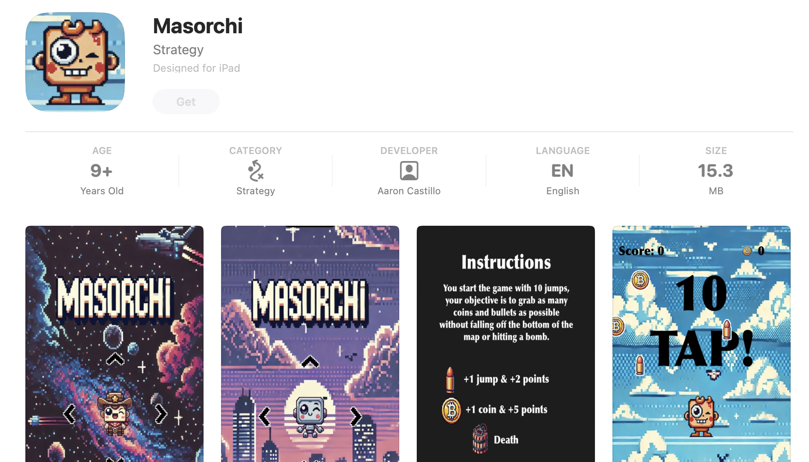

<!-- PROJECT LOGO -->
 

     
  </img>

<h3 align="center">Masorchi</h3>

  

    A 2D iPhone game developed in Swift and SpriteKit
     
     
    <a href="https://drive.google.com/file/d/1m45Z3hzaki-V27d0kVRnOLBGOju49u6p/view?usp=sharing">View Demo</a>
   
  

## About The Project

Welcome to Masorchi a 2D platform mobile game designed for players who love challenge, developed during my time at Marcy Labs.

Masorchi invites players into a vibrant 2D world where every tap is a jump and every decision counts. The game uniquely integrates mechanics like horizontal and vertical screen wraps, creating a dynamic gameplay experience unlike any other. As players navigate through the levels, they collect coins and bullets boosting their score and providing extra jumps.

Throughout my capstone journey, I dedicated the first four weeks to learning Swift and SpriteKit. During this initial phase, I completed small projects and followed detailed tutorials to solidify my understanding. I then spent the remaining four weeks to developing my final, comprehensive project. I’m proud of what I’ve built and excited for you to try it out. Download Masorchi today and let me know what you think!

Designed for both casual gamers and hardcore enthusiasts, Masorchi aims to bridge the gap by providing a challenging yet accessible gameplay experience.

Thank you for your interest in Masorchi. Dive in and enjoy a game where every tap brings you closer to beating your high score!

### Built With

- 
- 
- 
- 
- 

## Contact

Aaron Castillo(Product Owner/Developer) - https://github.com/acastillo3290 - https://www.linkedin.com/in/castillo-aaron/
